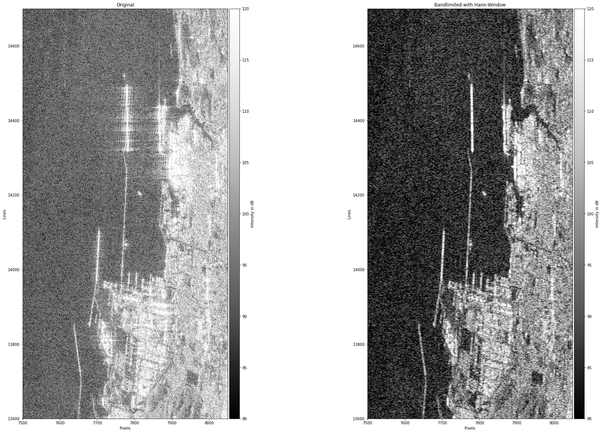
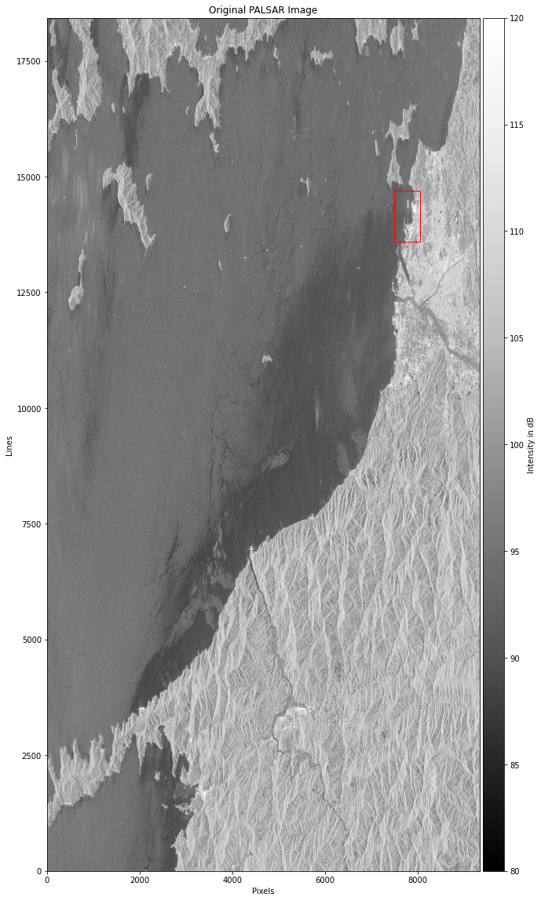
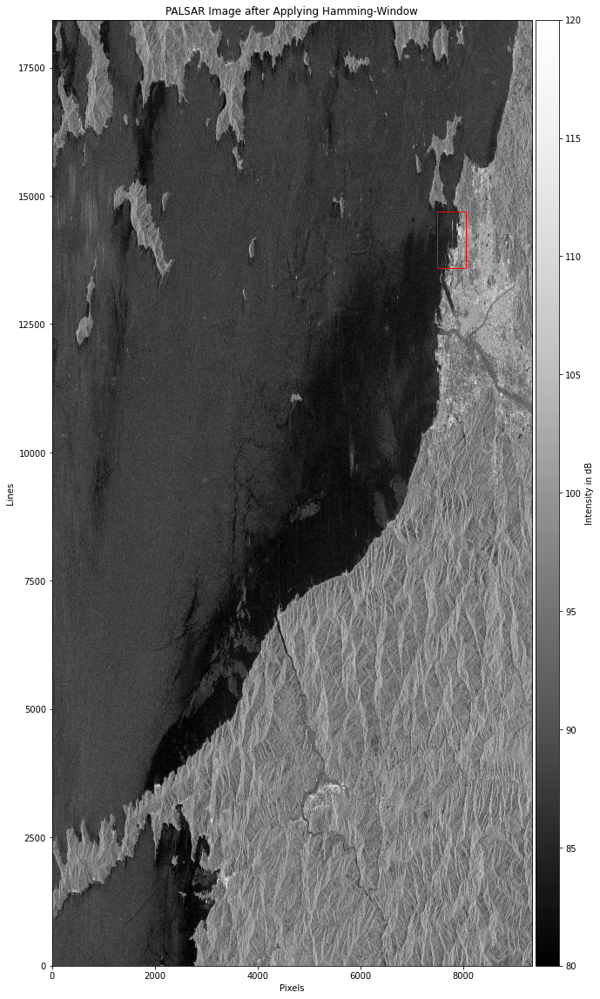
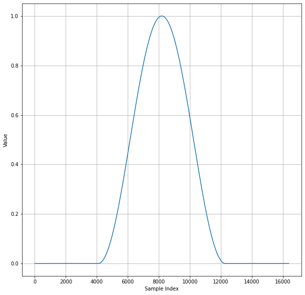

# Filtering an ALOS-PALSAR Dataset with Hanning-Window

All results and some explanations can be found in the notebook `hann_window_alospalsar.ipynb`.

## Summary

I wrote a notebook to visualize an ALOS-PALSAR L1.1 dataset, and to demonstrate the effect of applying a filter in the frequency domain. In short, the filter (i.e., the Hanning-window) decreases the noise level and---more importantly---reduces the level of the sidelobes caused by the PSF in range. This effect is shown in the figure below.

*Fig. 1: Demonstration of the effect of applying the Hanning window in the range frequency domain. The figure shows the area around Matsuyama airport without (left) and with filtering (right).*

The full scene before and after filtering with the Hanning-window is shown in the following figures.

*Fig. 2: Full PALSAR scene before filtering.*

*Fig. 3: Full PALSAR scene after filtering.*

The Hanning-window that is used for filtering in the frequency domain is shown in Fig. 4.

*Fig. 4: Hanning-window used for filtering in the range frequency domain.*

## How to Run the Code

1. Use Python3.8+ (I created this code in Python3.8).

2. Create virtual environment with a tool of your choice (I used `mkvirtualenv` from the `virtualenvwrapper`).

3. Install dependencies
    - If you use poetry, just run

    ```console
    poetry install
    ```
    in the main directory of the repository. This will install all the required dependencies.

    - If you prefer pip, run

    ```console
	 pip3 install -r requirements.txt 
    ```

4. Start a Jupyter Notebook server:

    ```console
	jupyter notebook
    ```

5. Inside Jupyter, navigate into the directory `notebooks` and open the notebook `hann_window_alospalsar.ipynb`. Execute the code cells and follow the instructions in the markdown cells.

## NOTE

Inside the notebook containing the main code, a lot of arrays are created for the purpose of visualization and interaction. This is not ideal, of course, as the because each takes up a lot of memory. I didn't mind that, because I have 128GB of RAM at my disposal. Should there be any problems running the notebook due to memory issues, please let me know, and I can make adjustments for the code to be a bit resource friendlier.
